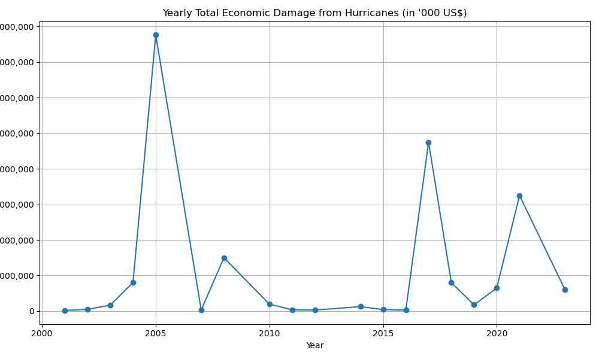
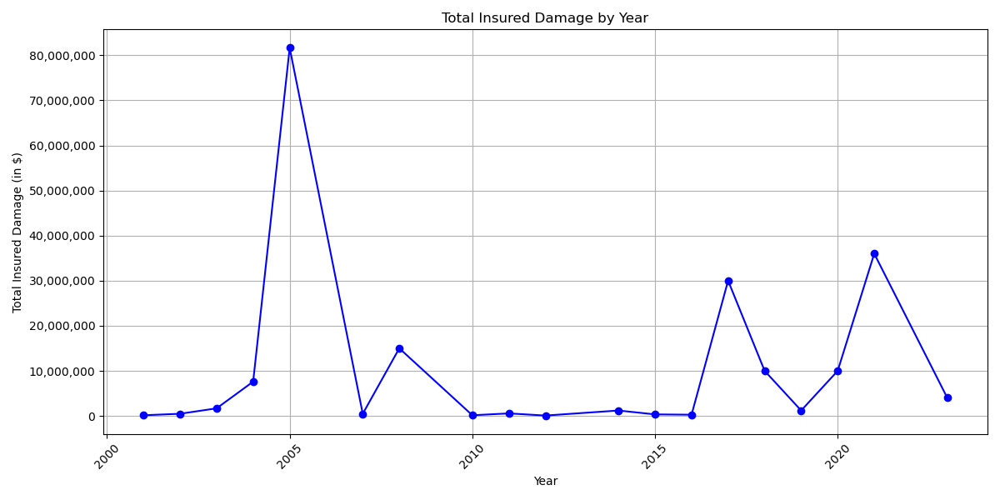
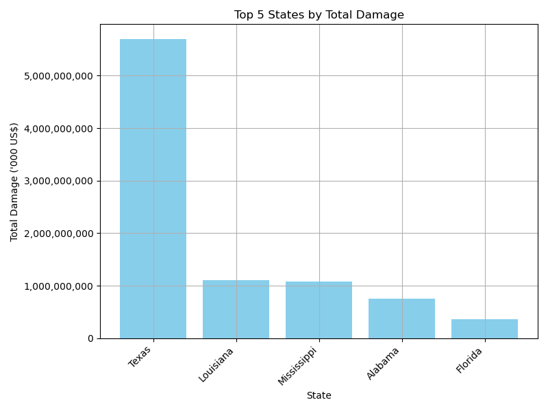
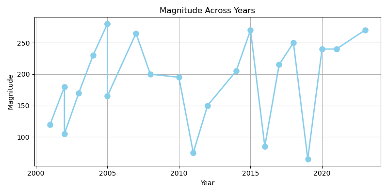
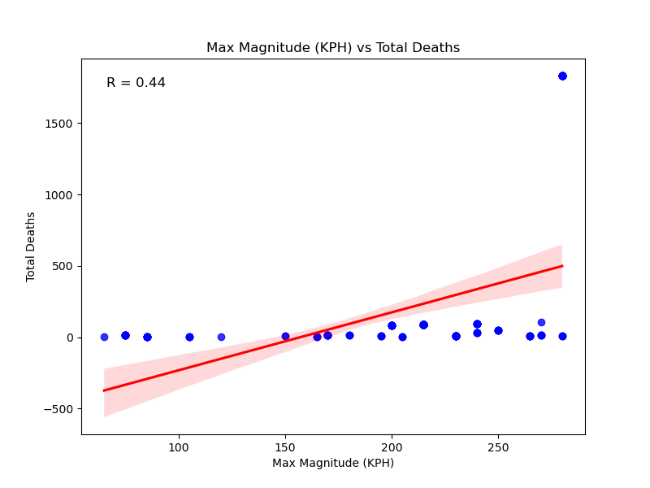
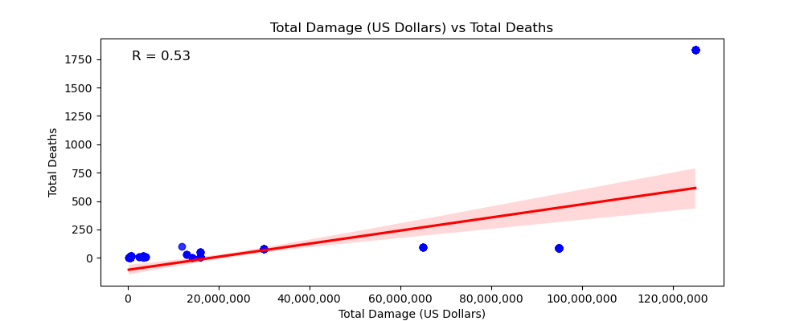
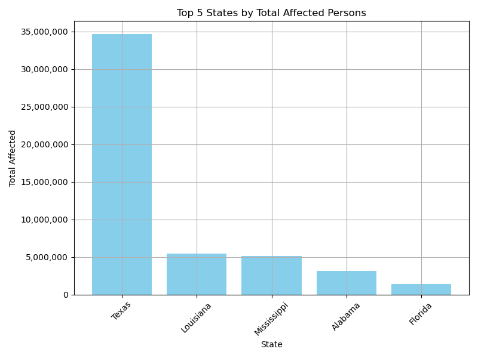
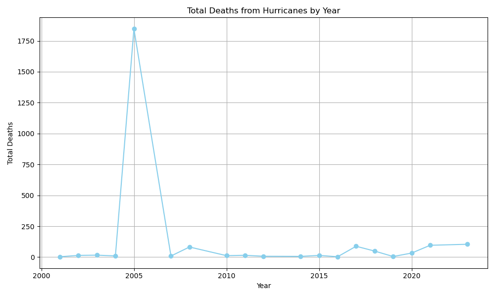
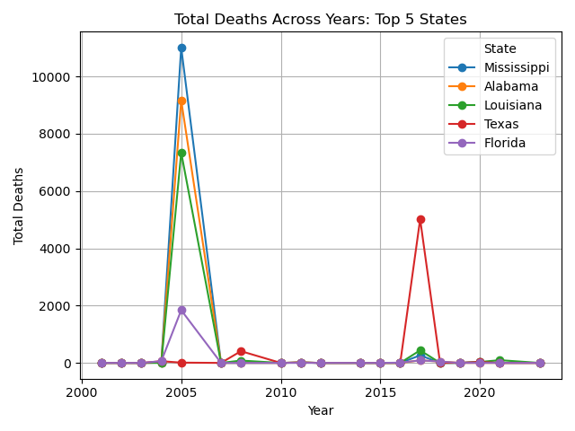

# Hurricane Impact Analysis

## Team Members:
- Tyler Bronner
- Sanem Gingery
- Eric McMullen
- Jonathan Miceli

## Class:
Northwestern Data Bootcamp

## Project Overview:
This project is a comprehensive analysis of the economic and social impacts of hurricanes in the United States, Canada, Mexico, and the U.S. Virgin Islands from 2000 to 2024. The analysis aims to identify patterns and correlations that can inform future hurricane preparedness and response efforts.

## Economic Impact:

### Overview:
This section analyzes the economic impacts of hurricanes, including damages, insurance claims, and government aid across the affected regions.

### Mapping:
- **Hurricane Economic Impact Map**
  

### Visualizations:
- **Yearly Total Economic Damage**
  

- **Yearly Total Insured Damage**
  

- **Top 5 States by Total Damage**
  

## Social Impact:

### Overview:
This section examines the social impacts of hurricanes, including displacement, health effects, and the strain on social services in affected communities.

### Mapping:
- **Social Impact Markers Map**
- This map outlines each location affected and displays a pop up with the location name, number of affected, total number of death, and the start and end date of that assocaiated event. Displaying data in this way helps visualize the impact of targeted hurricanes as well as house all relevant information.
  

### Visualizations:
- **Magnitude Across Years**
- Visualization of max magitude (kph) for all events of each year, across years. This helps us see that while there is variability, towards current time we can notice trends of higher wind speeds.
  

- **Magnitude vs Total Deaths**
- Building off of the last graphic, we can see that increasing wind speeds would actually be a very bad trend. We can see a moderately strong correlation here between max magnitude wind speed and total deaths. Increased wind speed over years would more than likely also mean an increase in total deaths.
  

- **Total Deaths vs Total Damage**
- There is a slighty stronger correlation between total damages and wind speed. This would suggest finding ways to mitigate damages would have an affect on decreasing number of total death as well.
  

- **Top 5 States by Total Affected Persons**
- Analyzing the data on a state level, we can see Texas has the highest levels of affected persons. Further research found that flooding as a result of hurricane may be responsible for this as well.
  

- **Total Deaths by Year**
- This graph analyzes total deaths at a whole level rather than a state level. Looking at overall trend across years.
  

- **Total Deaths Across Years: Top 5 States**
- This graph breaks down the total deaths by state level to visualize which states rankest highest in this category.
  
  

## Conclusion:
This project provides a detailed examination of the economic and social impacts of hurricanes over the last two decades. By analyzing data on damage, deaths, and displacement, the project offers insights into the effects of hurricanes and suggests areas for future research and policy focus.

### Sources:
- [EM-DAT: The International Disaster Database](https://public.emdat.be/data)
- [Pandas Documentation](https://pandas.pydata.org/pandas-docs/stable/)
- [Seaborn Documentation](https://seaborn.pydata.org/)
