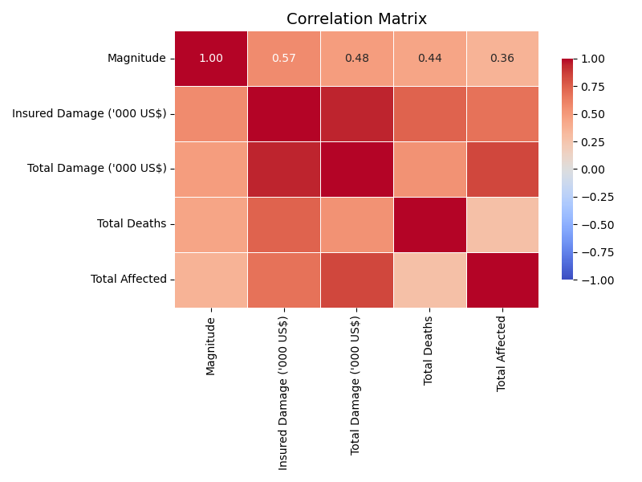
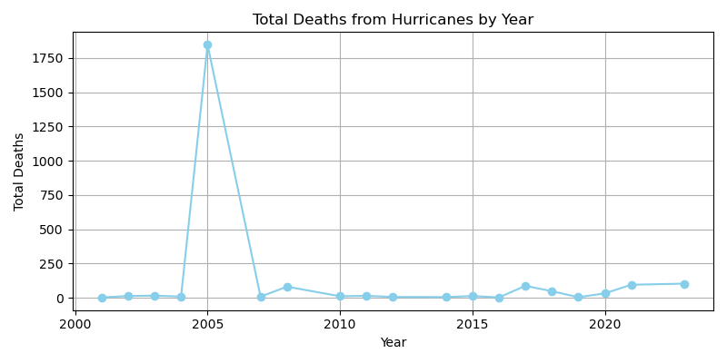

# Hurricane Impact Analysis

## Team Members:
- Tyler Bronner
- Sanem Gingery
- Eric McMullen
- Jonathan Miceli

## Class:
Northwestern Data Bootcamp

## Date:
8/18/2024

## Project Overview:
This project is a comprehensive analysis of the economic and social impacts of hurricanes in the United States, Canada, Mexico, and the U.S. Virgin Islands from 2000 to 2024. The analysis aims to identify patterns and correlations that can inform future hurricane preparedness and response efforts.

## Project Files:
- `Hurricane Impact Analysis.ipynb` - The main Jupyter Notebook containing the full analysis.
- `config.py` - Contains API keys and configuration settings.
- `Economic_Impact/` - Contains economic impact analysis scripts and data.
- `Social_Impact/` - Contains social impact analysis scripts and data.
- `Images/` - Contains all visualizations generated from the analysis.
- `Resource/` - Contains raw data files and supplementary materials.

## Research Proposal:

### Research Topic:
The Economic and Social Impacts of Hurricanes

### Database:
Data is sourced from the [EM-DAT: The International Disaster Database](https://public.emdat.be/data), which contains descriptive data for hurricanes that occurred between 2000 and 2024 in the United States, Canada, Mexico, and the U.S. Virgin Islands.

### Research Questions:
1. How do insured damages and total damages from hurricanes vary across different states or regions in the U.S. over the last 5 to 10 years?
2. What trends can be observed in the adjustment of hurricane-related damages for inflation?
3. Which hurricanes had the most significant economic impact, and how did they affect different sectors (e.g., residential, commercial)?
4. How do the economic impacts of different hurricanes compare, particularly focusing on high-impact events?
5. Is there a correlation between the intensity of hurricanes (e.g., wind speeds) and the magnitude of economic damage?
6. Which regions experienced the highest levels of displacement due to hurricanes, and how did this impact housing and social services?
7. How effective were reconstruction efforts in mitigating the long-term social impacts of major hurricanes?
8. How have the economic impacts of hurricanes changed over the last decade, and what factors might explain these changes?
9. Are there any discernible patterns in the timing and frequency of hurricanes that have caused the most damage?

## Tasks and Steps:

### 1. Data Collection and Preparation (Tyler Bronner):
- Collected hurricane data from the [Public EMDAT](https://public.emdat.be) database.
- Provided the collected data for further cleaning and preparation.

### 2. Data Visualization and Reporting (Sanem Gingery):
- Cleaned, formatted, and addressed missing data in the dataset collected from EMDAT.
- Prepared the cleaned data for analysis and visualization.

### 3. Economic Impact Analysis (Eric McMullen):
- Analyzed economic data, including damages, insurance claims, and government aid.
- Compared economic impacts across different hurricanes and identified trends.

### 4. Social Impact Analysis (Jonathan Miceli):
- Analyzed social data, including displacement, health effects, and community impacts.
- Evaluated demographic changes and the strain on social services in affected areas.

### 5. Coordination and Integration (All Members):
- Integrated each member's work to ensure a cohesive project flow.
- Managed the GitHub repository and oversaw the integration processes.

## Visualizations:

### Correlation Matrix

### Magnitude Across Years

### Top 5 States by Total Damage

### Top 5 States by Total Deaths

### Total Deaths by Year

### Magnitude vs Total Deaths

### Yearly Total Economic Damage

### Yearly Total Insured Damage

## Conclusion:
This project provides a detailed examination of the economic and social impacts of hurricanes over the last two decades. By analyzing data on damage, deaths, and displacement, the project offers insights into the effects of hurricanes and suggests areas for future research and policy focus.

### Sources:
- [EM-DAT: The International Disaster Database](https://public.emdat.be/data)
- [Pandas Documentation](https://pandas.pydata.org/pandas-docs/stable/)
- [Seaborn Documentation](https://seaborn.pydata.org/)

