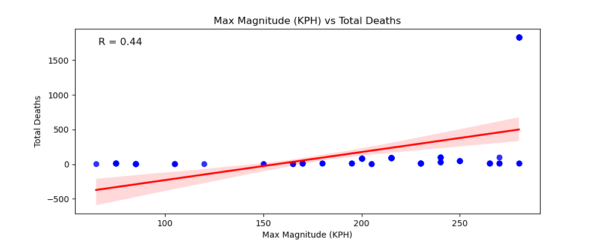

# Hurricane Impact Analysis

## Team Members:
- Tyler Bronner
- Sanem Gingery
- Eric McMullen
- Jonathan Miceli

## Class:
Northwestern Data Bootcamp

## Date:
8/18/2024

## Project Overview:
This project is a comprehensive analysis of the economic and social impacts of hurricanes in the United States, Canada, Mexico, and the U.S. Virgin Islands from 2000 to 2024. The analysis aims to identify patterns and correlations that can inform future hurricane preparedness and response efforts.

## Economic Impact:

### Overview:
This section analyzes the economic impacts of hurricanes, including damages, insurance claims, and government aid across the affected regions.

### Mapping:
- **Hurricane Economic Impact Map**
  

### Visualizations:
- **Yearly Total Economic Damage**
  

- **Yearly Total Insured Damage**
  

- **Top 5 States by Total Damage**
  

## Social Impact:

### Overview:
This section examines the social impacts of hurricanes, including displacement, health effects, and the strain on social services in affected communities.

### Mapping:
- **Social Impact Markers Map**
  

### Visualizations:
- **Magnitude Across Years**
  

- **Magnitude vs Total Deaths**
  

- **Total Deaths vs Total Damage**
  

- **Top 5 States by Total Affected Persons**
  

- **Total Deaths by Year**
  

- **Total Deaths Across Years: Top 5 States**
  
  

## Conclusion:
This project provides a detailed examination of the economic and social impacts of hurricanes over the last two decades. By analyzing data on damage, deaths, and displacement, the project offers insights into the effects of hurricanes and suggests areas for future research and policy focus.

### Sources:
- [EM-DAT: The International Disaster Database](https://public.emdat.be/data)
- [Pandas Documentation](https://pandas.pydata.org/pandas-docs/stable/)
- [Seaborn Documentation](https://seaborn.pydata.org/)
